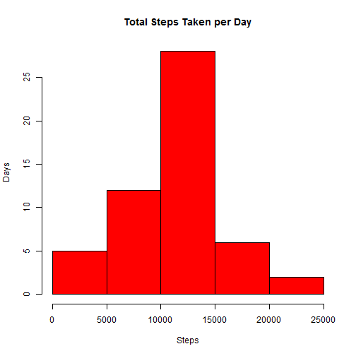
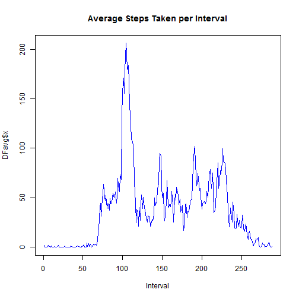
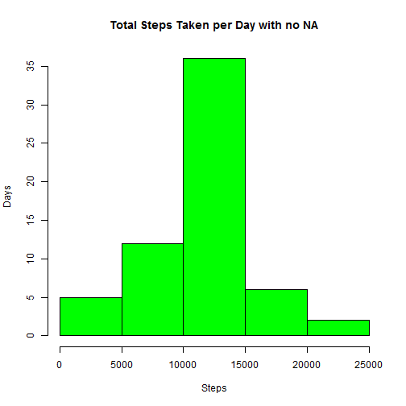
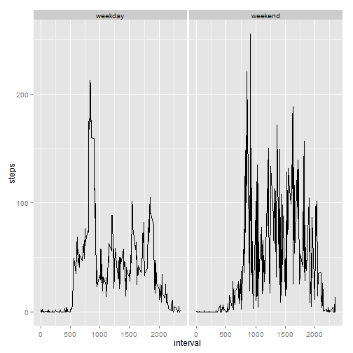

## Loading and preprocessing the data
Set the working directory

```r
setwd("C:\\Users\\Kirk\\Documents\\GitHub\\RepData_PeerAssessment1")
```


#### Read in the data

Read in the data and preprocess:


- change the steps to non-integer numeric
- change the date column to date format
- remove NA by only using complete cases


```r
DF <- read.csv("activity.csv")
DF[,1] <- as.numeric(DF[,1])
DF[,2] <- as.Date(DF[,2], "%Y-%m-%d")
DFcc <- complete.cases(DF)
DF2 <- DF[DFcc,]
```


## What is mean total number of steps taken per day?

```r
DFsum <- aggregate(DF2$steps, by = list(DF2$date), FUN = sum)

hist(DFsum$x, 
     col = "red" 
     ,main = "Total Steps Taken per Day"
     ,xlab = "Steps"
     ,ylab = "Days"
     )
```

 

## Mean steps per day
There were on average 37.3826 steps per day.

```r
mean(DF2$steps)
```

```
## [1] 37.38
```

## Median steps per day
The medain number of steps per day are 0.

```r
median(DF2$steps)
```

```
## [1] 0
```


## What is the average daily activity pattern?
Average the number of steps by the interval over the different days

```r
DFavg <- aggregate(DF2$steps, by = list(DF2$interval), FUN = mean)

plot(DFavg$x, 
     col = "blue" 
     ,main = "Average Steps Taken per Interval"
     ,xlab = "Interval"
     ,type = "l"
     )
```

 


## Imputing missing values


Replace all NAs with the average steps by interval and
combine with the complete cases to recreate the original
data set with all NAs removed.

```r
DFna <- DF[!DFcc,]
DFna <- merge(DFna, DFavg, by.x = "interval", by.y = "Group.1")
#Put the columns in the correct order for merging
DFna <- DFna[,c(4,3,1)]
colnames(DFna) <- colnames(DF2)
DF3 <- rbind(DF2, DFna)
```


Summarise the update dataset and plot the histogram.

```r
DFsum3 <- aggregate(DF3$steps, by = list(DF3$date), FUN = sum)

hist(DFsum3$x, 
     col = "green" 
     ,main = "Total Steps Taken per Day with no NA"
     ,xlab = "Steps"
     ,ylab = "Days"
     )
```

 


## Mean steps per day
There were on average 37.3826 steps per day.

```r
mean(DF3$steps)
```

```
## [1] 37.38
```

## Median steps per day
The medain number of steps per day are 0.

```r
median(DF3$steps)
```

```
## [1] 0
```


## Are there differences in activity patterns between weekdays and weekends?

Create a new factor variable with two levels:

- weekend
- weekday


And plot the average number of steps by interval for each factor.

```r
DFwe <- weekdays(DF3$date) == c("Sunday","Saturday")
fv <- factor(DFwe, labels = c("weekday", "weekend"))
DF4 <- cbind(DF3, fv)

DF4avg <- aggregate(DF4$steps, by = list(DF4$interval,DF4$fv), FUN = mean)
colnames(DF4avg) <- c("interval", "fv","steps")

library(ggplot2)

qplot(interval, steps, data = DF4avg, facets = ~fv, geom="line")
```

 


